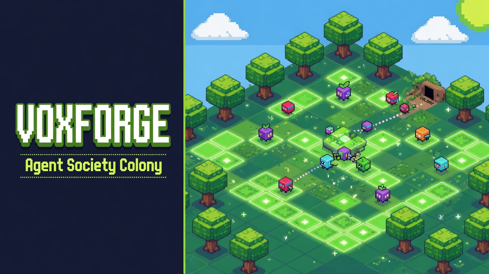
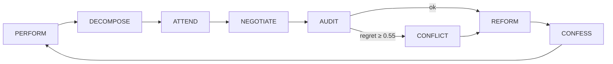

<p align="center">
  
</p>

<h1 align="center">VoxForge</h1>
<p align="center"><strong>THE ATTENTION AGENT SOCIETY</strong></p>
<p align="center">
  A living multi-agent colony that collaboratively designs and builds a real-time engineering workspace —<br/>
  visualized as a Conway ant-farm on a 96×96 voxel meadow, orchestrated by LangGraph, powered by Qwen Cloud.
</p>

<p align="center">
  
  
  
  
</p>

---

## What is this?

**VoxForge** is a sociomorphic computing demo: dozens (or hundreds) of specialist agents inhabit a shared grid, negotiate tasks, resolve conflicts, and iteratively build a collaborative workspace — while you watch them move across a **Conway's Game of Life** substrate in an isometric ant-colony view.

The society is not a chatroom. It is a **closed learning loop** where agents perform work, form qualitative dependencies, audit collective regret, reform when misaligned, and confess learnings back into institutional memory.

| Mode | What happens |
|------|----------------|
| **Run Society** | Full multi-agent LangGraph loop with negotiation, conflict resolution, and live SSE |
| **Run Baseline** | Single-agent control run for apples-to-apples efficiency comparison |
| **Colony Dashboard** | Minimap, sector stats, agent registry, and movement log |

---

## Colony visualization

The frontend renders a fixed **isometric orthographic** view — like watching an ant farm, not flying a camera.

```
┌─────────────────────────────────────┬──────────────────┐
│  Isometric colony view (ant-farm)   │  Dashboard       │
│  96×96 land patch                   │  · Colony map    │
│  Trees every 8 cells (even grid)    │  · Sector stats  │
│  Conway life = glowing substrate    │  · Agent registry│
│  Agents = instanced voxel cubes     │  · Movement log  │
│  Pan/zoom only (Shift+drag, scroll) │  · Metrics       │
└─────────────────────────────────────┴──────────────────┘
```

| Parameter | Value |
|-----------|-------|
| World grid | 96 × 96 cells |
| Walkable cells | ~9,095 |
| Tree spacing | Every 8 cells (margin 4) |
| Max agents | 512 default swarm (up to 2,048 instanced) |
| Default colony | 48 agents (6 specialists + 42 workers) |

**Controls:** Shift+drag to pan · scroll to zoom · click an agent to inspect dependencies.

---

## Learning loop

Each simulation tick runs the full society graph:

```
PERFORM → DECOMPOSE → ATTEND → NEGOTIATE → AUDIT → CONFLICT? → REFORM → CONFESS
```



| Agent | Role |
|-------|------|
| **Messenger** | Performs work, proposes artifacts, streams voxel progress |
| **Decomposer** | Breaks the VoxForge goal into subtasks, assigns specialists |
| **Attention** | Judges pairwise qualitative dependencies (economic, kinship, prestige…) |
| **Negotiator** | Structured proposal / counter-offer rounds on contested tasks |
| **Auditor** | Measures collective regret against the *ought* snapshot |
| **Conflict Resolver** | Voting & compromise when regret spikes or conflict is injected |
| **Reformer** | Adjusts agent adjectives and roles after misalignment |
| **Confessor** | Writes learnings to the Custodian weight matrix |
| **Lifecycle** | Birth/death rules driven by dependency strength on the grid |

### Specialist cast

| Specialist | Focus |
|------------|-------|
| Voxel Architect | Conway colony visualization |
| Orchestrator | LangGraph + SSE pipeline |
| Optimizer | Benchmark harness & metrics |
| Integrator | FastAPI + Three.js glue |
| UX Weaver | Dashboard, negotiation panel, controls |
| Critic / Evaluator | Society vs baseline comparison |

Workers fill the meadow with foraging, patrol, and relay behaviors — scaling the colony to hundreds of agents.

---

## Track 3 requirements

| Requirement | Implementation |
|-------------|----------------|
| Task decomposition & role assignment | `Decomposer` + `Attention` matching |
| Dialogue & negotiation | `Negotiator` with live negotiation panel |
| Conflict resolution | `ConflictResolver` on Auditor regret ≥ 0.55 |
| Efficiency gain | Dual mode + live metrics dashboard |

---

## Quick start

### Prerequisites

- Python 3.11+
- Node.js 18+
- [DashScope API key](https://dashscope.aliyun.com/) for Qwen Cloud (optional for UI; required for LLM calls)

### 1. Backend

```bash
cd backend
pip install -e .
uvicorn app.main:app --reload --port 8000
```

### 2. Frontend

```bash
cd frontend
npm install
npm run dev
```

### 3. Open the app

**http://localhost:5173**

The Vite dev server proxies `/api` → `http://localhost:8000`.

---

## Demo walkthrough

1. **Settings** → paste your DashScope API key → **Connect**
2. **Controls** → set colony size (default 48) → **Run Society**
3. **Colony** tab → watch minimap, sectors, and agent registry populate
4. **Metrics** tab → compare society vs baseline after both runs
5. **Inject Conflict** → trigger the conflict-resolution demo mid-run
6. **Step** / **Advance Phase** / **Pause** for manual pacing

---

## Qwen Cloud configuration

All agent roles use **Qwen Cloud (DashScope)** exclusively.

```bash
# Environment (optional — can also set via UI)
DASHSCOPE_API_KEY=sk-...
QWEN_API_KEY=sk-...          # alias
QWEN_MODEL=qwen-max          # default model
```

Per-role overrides are available in the **Settings** tab. Suggested mapping:

| Role | Model |
|------|-------|
| Auditor, Attention | `qwen-max` |
| Coding specialists | `qwen2.5-coder-32b-instruct` |
| General agents | `qwen-plus` |

### API endpoints

| Method | Path | Description |
|--------|------|-------------|
| `GET` | `/api/health` | Service health |
| `GET` | `/api/state` | Full simulation snapshot + colony stats |
| `GET` | `/api/stream` | SSE event stream |
| `POST` | `/api/sim/society` | Start society run `{ max_ticks, speed, agent_count }` |
| `POST` | `/api/sim/baseline` | Start baseline run |
| `POST` | `/api/sim/inject-conflict` | Force conflict resolution |
| `POST` | `/api/sim/step` | Advance one tick |
| `POST` | `/api/sim/pause` | Toggle pause |
| `GET` | `/api/metrics` | Society vs baseline comparison |
| `GET` | `/api/qwen/status` | Provider status & usage |
| `POST` | `/api/qwen/api-key` | Set API key for session |
| `POST` | `/api/qwen/configure` | Per-role model override |

---

## Architecture

```
sociomorphic-computing/
├── backend/
│   └── app/
│       ├── agents/          # Attention, Auditor, Negotiator, …
│       ├── graph/           # LangGraph simulation graph
│       ├── grid.py          # 96×96 allocation, sectors, walkability
│       ├── llm/             # QwenLLMFactory (DashScope)
│       ├── lifecycle/       # Birth/death on dependency graph
│       ├── simulation/      # Async runner + SSE queue
│       └── api/routes.py    # FastAPI endpoints
├── frontend/
│   └── src/
│       ├── scene/ColonyScene.ts   # Isometric Conway colony (Three.js)
│       ├── ui/Dashboard.ts      # Tabbed dashboard + colony panel
│       └── sse/client.ts        # Live event stream
└── docs/
    └── voxforge-readme-banner.jpg  # Retro voxel banner (Grok Imagine)
```

**Backend:** FastAPI · LangGraph · LangChain · Pydantic · SSE-Starlette · scikit-learn (Attention embeddings)

**Frontend:** TypeScript · Vite · Three.js (instanced meshes, orthographic isometric camera)

---

## Society vs baseline metrics

After running both modes, the dashboard compares:

- **Quality score** (1 − Auditor regret)
- **Iterations** to completion
- **Conflicts detected / resolved**
- **Negotiation rounds**
- **Transparency events** (SSE + playbook entries)
- **Token usage** (Qwen Cloud)
- **VoxForge feature completion** (%)

The society is designed to win on **quality and transparency** while the baseline wins on raw iteration count — making the tradeoff visible and measurable.

---

## Development

```bash
# Frontend production build
cd frontend && npm run build

# Backend health check
curl http://localhost:8000/api/health
```

Grid constants live in `backend/app/grid.py` and mirror `frontend/src/scene/ColonyScene.ts` (`WORLD_SIZE=96`, `TREE_SPACING=8`).

---

## License

MIT — built for the Agent Society Design hackathon track.

<p align="center"><sub>Watch the colony think. Measure the society win.</sub></p>