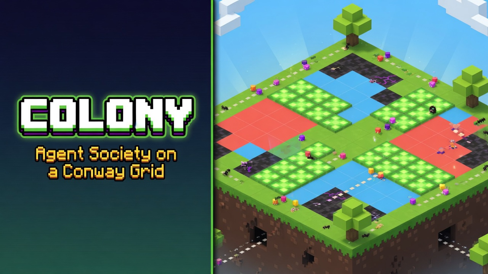
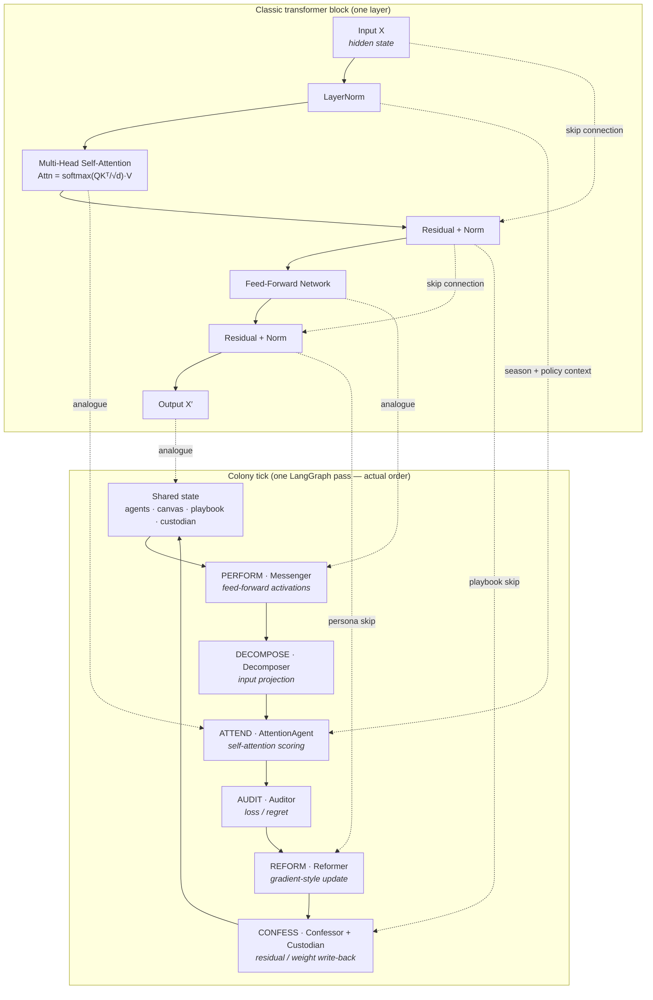
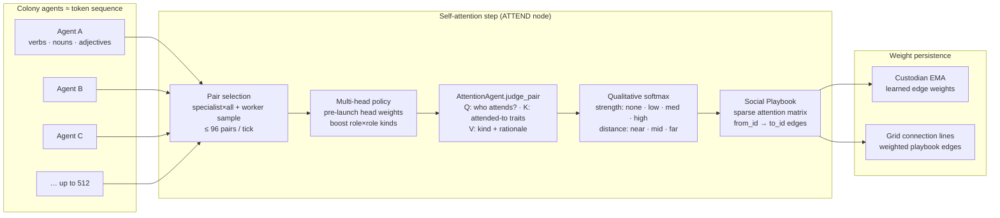
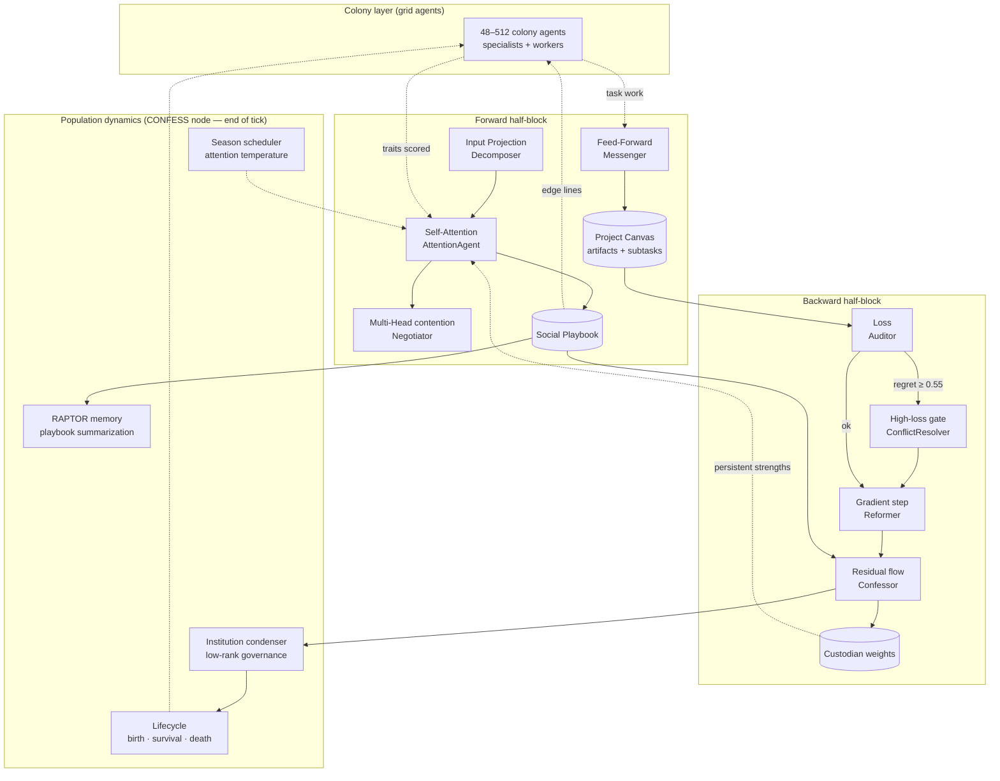
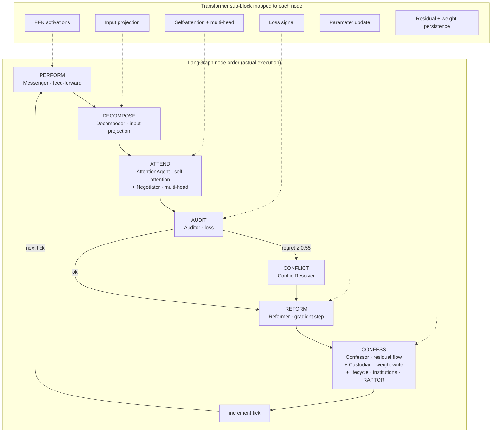

<p align="center">
  
</p>

<h1 align="center">Colony</h1>
<p align="center"><strong>Agent society on a Conway grid</strong></p>
<p align="center">
  A transformer architecture reinterpreted as living social physics —<br/>
  gamified into conscious agents on a Conway ant-farm colony, orchestrated by LangGraph, powered by Qwen Cloud or OpenRouter.
</p>

<p align="center">
  
  
  
  
</p>

---

## What is this?

**Colony** is an exploration in qualitative social physics: dozens (or hundreds) of specialist agents inhabit a shared grid, negotiate tasks, resolve conflicts, and iteratively build a collaborative workspace — while you watch them move across a **Conway's Game of Life** substrate in an isometric ant-colony view.


https://github.com/user-attachments/assets/84cb57be-42ab-4fd7-9ef4-0b94bab38531


The society is not a chatroom. It is a **closed learning loop** where agents perform work, form dependencies, audit collective regret, reform when misaligned, and write learnings back into the weight graph. Each tick is a forward/backward pass of the transformer role model, made visible on the grid.

| Mode | What happens |
|------|----------------|
| **Run Society** | Full multi-agent LangGraph loop with negotiation, conflict resolution, and live SSE |
| **Run Baseline** | Single-agent control run for apples-to-apples efficiency comparison |
| **Colony Dashboard** | Minimap, sector stats, agent registry, and movement log |

### Successor to [open-deepthink](https://github.com/iblameandrew/open-deepthink)

Colony continues the qualitative-neural-network line from [open-deepthink](https://github.com/iblameandrew/open-deepthink), which mapped agents onto a **layered feed-forward MLP**: parallel layer execution, Mirror Descent on personas, and epoch reframing — without an attention mechanism.

Colony upgrades that design to a **full transformer block**. Each simulation tick runs one conceptual block pass: colony agents are the **token sequence** being attended; orchestrator modules (Messenger, AttentionAgent, Auditor, …) are the **block operators** that score pairs, route work, compute loss, and write residuals back into persistent edge weights.

| | open-deepthink | Colony |
|---|----------------|--------|
| **Core analogue** | Stacked MLP layers | Transformer block |
| **Relational scoring** | Layer-to-layer context | **Attention Agent** (pairwise weights) |
| **Forward pass** | Layered parallel forward | Feed-Forward + Input Projection + Multi-Head agents |
| **Backward pass** | Mirror Descent on prompts | Loss + Residual Flow + Gradient Descent agents |
| **Persistent state** | Evolved personas / topology archive | Weight Agent + Social Playbook dependency graph |
| **View** | QNN topology UI | Conway grid + isometric colony |

---

## The Conceptual Transformer

### Two layers — don't conflate them

Colony uses the word *agent* in two distinct ways. The diagrams below keep them separate so the transformer analogy stays precise.

| Layer | What it is | Count | On the grid? |
|-------|------------|-------|--------------|
| **Colony agents** | Specialists + workers that perform tasks and get pairwise-scored | 48–512 | Yes — one voxel stack each |
| **Orchestrator modules** | Singleton Python classes that run once per tick (Messenger, AttentionAgent, Auditor, …) | ~12 | No — they operate on shared state |

Colony agents **do not wire together into MatMul / Softmax / FFN layers** when they associate. Association means: the **AttentionAgent** orchestrator scores pairs → edges land in the **Social Playbook** → **Custodian** EMA-blends persistent weights → lifecycle and institutions react. The grid lines you see are playbook edges visualized, not a literal tensor graph.

The transformer block is the **per-tick LangGraph loop** around shared state (`agents`, `canvas`, `playbook`, `custodian`). Colony agents are the **sequence being transformed**; orchestrator modules are the **operators**.

### One tick = one transformer block



> **Order note:** A classic block lists projection → attention → FFN left-to-right. Colony runs **FFN → projection → attention** within the forward half (`PERFORM → DECOMPOSE → ATTEND`) because agents produce artifacts before subtasks are re-routed and pairs are scored. The *roles* still map cleanly; only the scheduling differs.

### Self-attention analogue

In a transformer, every token attends to every other token. In Colony, every **colony agent** can be scored against every other agent each tick — that pairwise judgment *is* the self-attention step.



| Transformer primitive | Colony implementation |
|-----------------------|----------------------|
| Token embeddings | Agent trait vectors (`verbs`, `nouns`, `adjectives`, `role`) |
| Q / K / Kᵀ | Pairwise comparison of agent A's traits toward agent B |
| Attention weights | `DependencyEntry.strength` + `qualitative_distance` |
| Attention matrix | `SocialPlaybook` — growing list of directed edges |
| Multi-head attention | Pre-launch **attention head policy** (14 societal functions, weighted heads) + **Negotiator** on contested pairs |
| Softmax | Qualitative bucketing + season temperature (`sharp` filters weak edges) |
| Learned parameters | `Custodian` EMA on `from_id→to_id` keys (`custodian.json`) |

### Neural component → orchestrator mapping

| Neural / Transformer Component | Orchestrator module | LLM role ID | Function |
|-------------------------------|------------|-------------|----------|
| Cost function / loss | `Auditor` | `loss_agent` | Computes collective regret (loss) against the target state and broadcasts the signal. |
| Backward connections / residual flow | `Confessor` | `residual_flow_agent` | Propagates feedback along dependency edges (residual / backward flow). |
| Gradient descent / parameter update | `Reformer` | `gradient_descent_agent` | Applies parameter updates when alignment drifts (gradient step on roles and traits). |
| Feed-forward activation | `Messenger` | `feed_forward_agent` | Routes activations and task output between colony agents (feed-forward pass). |
| Learned weights / persistent parameters | `Custodian` | `weight_agent` | Stores persistent edge weights and dependency strengths (learned parameters). |
| Core attention mechanism | `AttentionAgent` | `attention_agent` | Scores pairwise relevance between colony agents (attention weights). |
| Attention matrix / dependency graph | `SocialPlaybook` | — | Maintains the live dependency graph: distances, strengths, and rationales. |
| Low-rank condensation / clustering | `InstitutionCondenser` | `low_rank_agent` | Condenses repeated playbook patterns into stable governance rules. |
| Agent creation rule | `LifecycleRules` | — | Spawns agents when dependency thresholds are met. |
| Persistence rule | `LifecycleRules` | — | Keeps agents active while connection strength stays above threshold. |
| Dissolution rule | `LifecycleRules` | — | Removes isolated or overloaded agents and returns capacity to the pool. |
| Temporal modulation | `SeasonScheduler` | — | Alternates sharp vs diffuse loss and attention coefficients across ticks. |
| Higher-order memory consolidation | `RaptorMemory` | `hierarchical_memory_agent` | Summarizes playbook history into hierarchical memory structures. |

### Forward / backward data flow

Orchestrator modules are **not** colony agents on the grid. They are tick-level operators that read and write shared state:



> **Operational layer:** The [Learning loop](#learning-loop) section below shows the exact LangGraph node order, module names, and when regret vs backward pass fire.

---

## Colony visualization

The frontend renders a fixed **isometric orthographic** view — like watching an ant farm, not flying a camera.

```
┌─────────────────────────────────────┬──────────────────┐
│  Isometric colony view (ant-farm)   │  Dashboard       │
│  96×96 land patch                   │  · Colony map    │
│  Trees every 8 cells (even grid)    │  · Sector stats  │
│  Agents = instanced voxel cubes     │  · Agent registry│
│  Playbook edges = connection lines  │  · Movement log  │
│  Pan/zoom only (Shift+drag, scroll) │  · Metrics       │
└─────────────────────────────────────┴──────────────────┘
```

| Parameter | Value |
|-----------|-------|
| World grid | 96 × 96 cells |
| Walkable cells | ~9,095 |
| Tree spacing | Every 8 cells (margin 4) |
| Max agents | 512 default swarm (up to 2,048 instanced) |
| Default colony | 48 agents (6 specialists + 42 workers) |

**Controls:** Shift+drag to pan · scroll to zoom · click an agent to inspect dependencies.

---

## Learning loop

Each simulation tick runs the full society graph — one transformer-block pass over shared state:

```
PERFORM → DECOMPOSE → ATTEND (+ negotiate) → AUDIT → CONFLICT? → REFORM → CONFESS → tick++
```



| Agent | Transformer analogue | Role |
|-------|---------------------|------|
| **Feed-Forward Agent** | Feed-forward activation | Performs work, proposes artifacts, streams voxel progress |
| **Input Projection Agent** | Task routing / input projection | Breaks the project goal into subtasks, assigns specialists |
| **Attention Agent** | Core attention mechanism | Judges pairwise qualitative dependencies (economic, kinship, prestige…) |
| **Multi-Head Agent** | Multi-head contention resolution | Structured proposal / counter-offer rounds on contested tasks |
| **Loss Agent** | Cost function / loss | Measures collective regret against the *ought* snapshot |
| **Intervention Agent** | High-loss intervention | Voting & compromise when regret spikes or conflict is injected |
| **Gradient Descent Agent** | Gradient descent / update | Adjusts agent adjectives and roles after misalignment |
| **Residual Flow Agent** | Backward / residual flow | Writes learnings to the Weight Agent matrix |
| **Lifecycle** | Birth · survival · death rules | Agents emerge, endure, or dissolve based on dependency strength |
| **Low-Rank Agent** | Low-rank condensation | Condensed governance rules from repeated playbook patterns |
| **Seasons** | Temporal modulation | Sharp vs diffuse judgment across macro/micro cycles |
| **Hierarchical Memory Agent** | Hierarchical memory | Long-horizon synthesis of playbook history |

### Regret, backward pass, and institutions

**Tick number ≠ loss timing.** The HUD tick advances at `tick_started` — the *opening* of each LangGraph pass. **Regret (loss) is computed later in the same tick**, during **AUDIT**, after PERFORM, DECOMPOSE, and ATTEND complete. If you are on tick 5 but ATTEND is still scoring pairs (the slowest phase when an LLM backend is connected), the regret label will not move until AUDIT finishes for that tick.

| Phase | Position in tick | Transformer role | What updates |
|-------|------------------|------------------|--------------|
| **ATTEND** | Early (often longest) | Self-attention | Playbook edges; `attention_progress` in Activity |
| **AUDIT** | Mid-tick | Loss | `auditor_regret` event; regret label and quality score |
| **CONFLICT** | Optional | High-loss gate | Only if regret ≥ 0.55 or conflict injected |
| **REFORM** | After audit / conflict | Gradient step | Agent adjectives and verbs adjusted toward *ought* |
| **CONFESS** | End of tick | Backward pass | Custodian weight write-back, institutions, lifecycle, RAPTOR; then `tick++` |

**Loss vs backward pass — don't conflate them:**

- **AUDIT (`Auditor` / `loss_agent`)** — forward-half *evaluation*. Measures collective regret against the *ought* snapshot and broadcasts the signal. This is when the top-bar **Regret** value changes.
- **CONFESS (`Confessor` / `residual_flow_agent` + `Custodian`)** — backward-half *write-back*. Propagates feedback along that tick's dependency edges and EMA-blends persistent weights in `custodian.json`. Runs **after** REFORM, still within the same tick, before the counter increments.

In the Activity log, look for this sequence each tick:

```
tN · tick started
tN · phase ATTEND
tN · phase AUDIT          ← regret appears here
tN · regret 0.62
tN · phase REFORM
tN · phase CONFESS        ← backward pass + institutions
```

**Why regret might look stuck at 0.00 or unchanged:**

- The current tick is still in **ATTEND** — no AUDIT yet for that tick (earlier ticks may already have regret values in the log).
- **No API key** — audit uses a heuristic (`1 − quality` from task completion + adjective overlap); values can plateau until subtasks move.
- **Regret 0.00** is a valid low-loss reading, not a missing signal.

**Institution formation** (`InstitutionCondenser` in CONFESS) — condensed governance from repeated strong playbook patterns:

| Criterion | Threshold | Notes |
|-----------|-----------|-------|
| Strong edges in playbook | **≥ 15** cumulative | Only `med` and `high` strength count; `low` / `none` are ignored |
| Cluster size | **≥ 3** entries per cluster | KMeans on strong-entry vectors; clusters smaller than 3 are skipped |
| Novelty | Unique member set | Won't duplicate an institution for the same agent IDs |
| Phase | **CONFESS** only | Same end-of-tick pass as backward flow and lifecycle |

With the **minimum colony size (4 agents)** — four specialists, zero workers — you get roughly **12 attention pairs per tick** (specialist×all). Institutions typically appear around **tick 3–8**, depending on season temperature (`sharp` filters weak edges) and how many bonds reach `med`/`high`. They are unlikely on tick 1. In a **`diffuse` macro season**, an institution can **dissolve** if strong edges involving its members drop below 3.

> **Agent count floor:** The UI and backend enforce `agent_count ≥ 4` (`create_colony_agents` clamps to 4–512).

### Architecture disagreements

**Architecture disagreements** are the narrative label for **high-loss conflict rounds** — simulated disputes over how the colony should structure the build. They are not a separate mechanic; they are what the **CONFLICT** phase produces when collective regret is high.

**When they fire**

The `ConflictResolver` (`Intervention Agent`) runs only when:

1. **Auditor regret ≥ 0.55** after AUDIT — the colony is misaligned with the *ought* snapshot, or
2. You click **Inject Conflict** in the UI (`POST /api/sim/inject-conflict`), which forces a round for demo purposes.

This is the “high-loss gate” in the transformer analogue: loss spikes → intervention → compromise → reform continues.

**What happens**

The first two agents in the roster act as **disputants**. The resolver mediates one structured round:

| Field | Meaning |
|-------|---------|
| **Topic** | Usually a Colony-wide design question (not a single subtask) |
| **Proposal / counter-offer** | Competing approaches attributed to each disputant |
| **Outcome** | `compromise`, `voting`, or similar |
| **Decision** | Final resolution text, appended to the project canvas |

With GenAI connected, the `Intervention Agent` generates topic and wording from regret, the audit narrative, and recent negotiations. Without an API key, the heuristic fallback is literally titled **“Architecture disagreement”** — e.g. *modular LangGraph* vs *shared canvas*, resolved by voting.

**Artifacts produced**

- A `NegotiationRound` in the **Negotiations** panel
- A canvas **decision** string
- An **`architecture` artifact** titled “Conflict Resolution”
- A `conflict_resolved` SSE event
- Disputants lose `hostile` and gain `aligned` adjectives

**vs task negotiations (ATTEND)**

| | **Task negotiations** | **Architecture disagreements** |
|--|----------------------|-------------------------------|
| **Phase** | ATTEND (every tick with active tasks) | CONFLICT (regret ≥ 0.55 or injected) |
| **Orchestrator** | `Negotiator` / Multi-Head Agent | `ConflictResolver` / Intervention Agent |
| **Topic** | Current subtask title (e.g. “SSE Pipeline”) | Colony system design dispute |
| **Trigger** | Two+ agents with assigned subtasks | High regret or **Inject Conflict** |
| **Purpose** | Multi-head contention on contested work | Track 3 conflict-resolution demo |

In short: when regret spikes, specialists “disagree” on how to structure the project; the Intervention Agent forces a compromise, logs it as an architecture decision, and the loop proceeds to REFORM.

### Specialist cast

| Specialist | Focus |
|------------|-------|
| Voxel Architect Agent | Conway colony visualization |
| Orchestrator Agent | LangGraph + SSE pipeline |
| Optimizer Agent | Benchmark harness & metrics |
| Integrator Agent | FastAPI + Three.js glue |
| UX Weaver Agent | Dashboard, negotiation panel, controls |
| Critic Evaluator Agent | Society vs baseline comparison |

Workers fill the meadow with foraging, patrol, and relay behaviors — scaling the colony to hundreds of agents.

---

## Track 3 requirements

| Requirement | Implementation |
|-------------|----------------|
| Task decomposition & role assignment | `Input Projection Agent` + `Attention Agent` matching |
| Dialogue & negotiation | `Multi-Head Agent` with live negotiation panel |
| Conflict resolution | `Intervention Agent` on regret ≥ 0.55 — [architecture disagreements](#architecture-disagreements) |
| Efficiency gain | Dual mode + live metrics dashboard |

---

## Quick start

### Prerequisites

- Python 3.11+
- Node.js 18+
- **GenAI API key** (optional for UI; required for LLM calls):
  - [DashScope](https://dashscope.aliyun.com/) (Qwen Cloud), or
  - [OpenRouter](https://openrouter.ai/keys) (any compatible model slug)

### 1. Backend

```bash
cd backend
pip install -e .
uvicorn app.main:app --reload --port 8001
```

### 2. Frontend

```bash
cd frontend
npm install
npm run dev
```

### 3. Open the app

**http://localhost:5173**

The Vite dev server proxies `/api` → `http://localhost:8001`. Use **5173** in development (not `:8000` directly) so the UI and API stay in sync.

---

## Demo walkthrough

1. **Settings** → choose **Qwen Cloud** or **OpenRouter** → set model slug (OpenRouter) → paste API key → **Connect**
2. **Controls** → set colony size (default 48) and tick budget → **Deploy Colony**
3. **Colony** tab → watch minimap, sectors, and agent registry populate
4. **Metrics** tab → compare society vs baseline after both runs
5. **Inject Conflict** → trigger the conflict-resolution demo mid-run
6. **Reset Colony** → stop the sim and return to idle
7. **Step** / **Advance Phase** / **Pause** for manual pacing

---

## GenAI backend configuration

Colony supports two LLM backends via the OpenAI-compatible SDK (`langchain-openai`):

| Backend | Provider | Key source | Model routing |
|---------|----------|------------|---------------|
| **DashScope** (default) | Qwen Cloud | [DashScope console](https://dashscope.aliyun.com/) | Per-role catalogue in Settings |
| **OpenRouter** | OpenRouter | [openrouter.ai/keys](https://openrouter.ai/keys) | Single model slug for all agents (default `nex-agi/nex-n2-pro`) |

**Settings tab**

1. Pick **Provider** (DashScope or OpenRouter).
2. For OpenRouter, set **Model slug** (e.g. `nex-agi/nex-n2-pro`).
3. Paste API key → **Connect** (one validation attempt; no retry loops).
4. For DashScope only: override models per role in the catalogue grid.

Keys persist in browser `localStorage` (separate keys per provider) and restore on reload.

```bash
# Environment (optional — can also set via UI)
GENAI_BACKEND=dashscope                            # or openrouter
DASHSCOPE_API_KEY=sk-...                           # Qwen Cloud
QWEN_API_KEY=sk-...                                # alias for DashScope
OPENROUTER_API_KEY=sk-or-...                       # OpenRouter
OPENROUTER_MODEL=nex-agi/nex-n2-pro                # default slug when using OpenRouter
QWEN_MODEL=qwen3.6-flash-2026-04-02                # default per-role model (DashScope)
```

**DashScope defaults (June 2026):** every role starts on **`qwen3.6-flash-2026-04-02`**. Override per role in Settings for heavier models (e.g. `qwen3.7-max-2026-06-08` for reasoning, `qwen2.5-coder-32b-instruct` for code).

Without a valid API key, agents run in **heuristic mode** (audit, negotiation, and conflict text use fallbacks).

### API endpoints

| Method | Path | Description |
|--------|------|-------------|
| `GET` | `/api/health` | Service health (`api_version: genai-v2`) |
| `GET` | `/api/state` | Full simulation snapshot + colony stats |
| `GET` | `/api/stream` | SSE event stream |
| `POST` | `/api/sim/society` | Start society run `{ max_ticks, speed, agent_count, prompt }` |
| `POST` | `/api/sim/baseline` | Start baseline run |
| `POST` | `/api/sim/reset` | Stop sim and return to idle |
| `POST` | `/api/sim/inject-conflict` | Force conflict resolution |
| `POST` | `/api/sim/step` | Advance one tick |
| `POST` | `/api/sim/pause` | Toggle pause |
| `GET` | `/api/metrics` | Society vs baseline comparison |
| `GET` | `/api/qwen/status` | GenAI provider status & usage |
| `POST` | `/api/qwen/setup` | Set backend + model slug |
| `POST` | `/api/genai/configure` | Alias for `/api/qwen/setup` |
| `POST` | `/api/qwen/api-key` | Connect API key `{ api_key, backend?, model_slug? }` |
| `POST` | `/api/qwen/configure` | Per-role model override (DashScope only) |

---

## Architecture

```
colony/
├── backend/
│   └── app/
│       ├── agents/          # Attention, Auditor, Negotiator, …
│       ├── graph/           # LangGraph simulation graph
│       ├── grid.py          # 96×96 allocation, sectors, walkability
│       ├── llm/             # QwenLLMFactory (DashScope + OpenRouter)
│       ├── lifecycle/       # Birth/death on dependency graph
│       ├── simulation/      # Async runner + SSE queue
│       └── api/routes.py    # FastAPI endpoints
├── frontend/
│   └── src/
│       ├── scene/colony-scene.ts  # Isometric Conway colony (Three.js)
│       ├── ui/Dashboard.ts      # Tabbed dashboard + colony panel
│       └── sse/client.ts        # Live event stream
└── docs/
    └── colony-banner.jpg             # Retro voxel banner (Grok Imagine)
```

**Backend:** FastAPI · LangGraph · LangChain · Pydantic · SSE-Starlette · scikit-learn (Attention embeddings)

**Frontend:** TypeScript · Vite · Three.js (instanced meshes, orthographic isometric camera)

---

## Society vs baseline metrics

After running both modes, the dashboard compares:

- **Quality score** (1 − Auditor regret)
- **Iterations** to completion
- **Conflicts detected / resolved**
- **Negotiation rounds**
- **Transparency events** (SSE + playbook entries)
- **Token usage** (active GenAI provider)
- **Colony progress** (%)

The society is designed to win on **quality and transparency** while the baseline wins on raw iteration count — making the tradeoff visible and measurable.

---

## Development

```bash
# Frontend production build
cd frontend && npm run build

# Backend health check
curl http://localhost:8001/api/health
```

Grid constants live in `backend/app/grid.py` and mirror `frontend/src/scene/colony-scene.ts` (`WORLD_SIZE=96`, `TREE_SPACING=8`).

---

## License

MIT — built for the Agent Society Design hackathon track.

<p align="center"><sub>Transformer primitives as social roles. Watch the colony compute.</sub></p>
