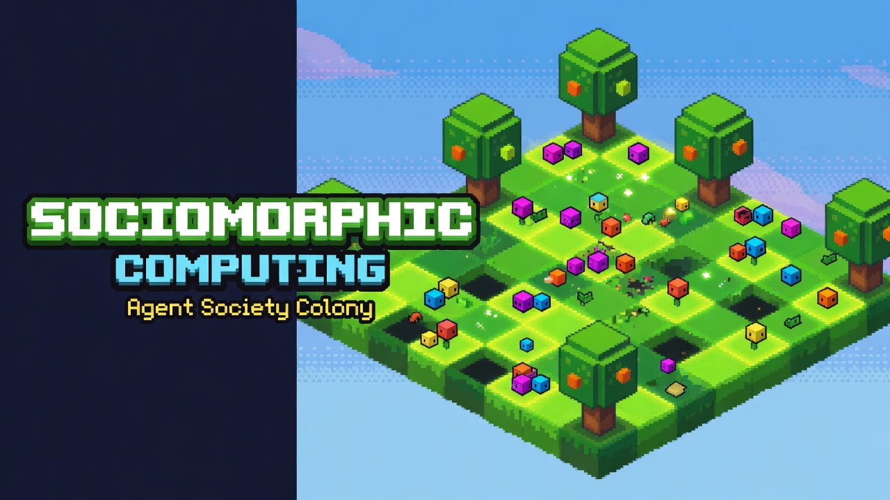
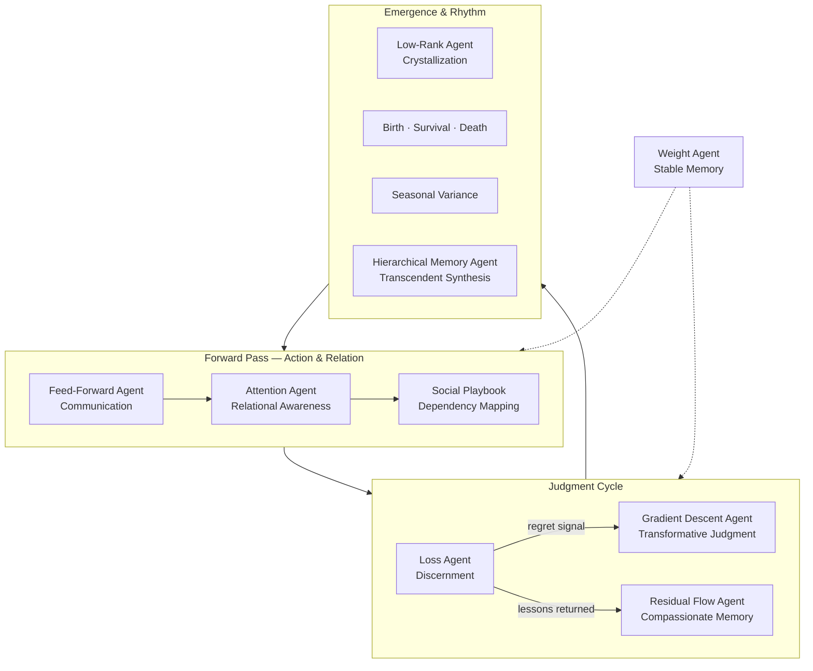
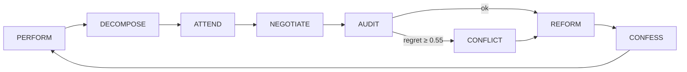

<p align="center">
  
</p>

<h1 align="center">Sociomorphic Computing</h1>
<p align="center"><strong>The Attention Agent Society</strong></p>
<p align="center">
  A transformer architecture reinterpreted as living social physics —<br/>
  gamified into conscious agents on a Conway ant-farm colony, orchestrated by LangGraph, powered by Qwen Cloud.
</p>

<p align="center">
  
  
  
  
</p>

---

## What is this?

**Sociomorphic Computing** is an exploration in qualitative social physics: dozens (or hundreds) of specialist agents inhabit a shared grid, negotiate tasks, resolve conflicts, and iteratively build a collaborative workspace — while you watch them move across a **Conway's Game of Life** substrate in an isometric ant-colony view.

The society is not a chatroom. It is a **closed learning loop** where agents perform work, form qualitative dependencies, audit collective regret, reform when misaligned, and confess learnings back into institutional memory. Under the hood, every tick is a ritual cycle of action, reflection, judgment, and renewal — the forward and backward passes of a transformer, made visible.

| Mode | What happens |
|------|----------------|
| **Run Society** | Full multi-agent LangGraph loop with negotiation, conflict resolution, and live SSE |
| **Run Baseline** | Single-agent control run for apples-to-apples efficiency comparison |
| **Colony Dashboard** | Minimap, sector stats, agent registry, and movement log |

---

## The Conceptual Transformer

### Gamified social physics

The Attention Agent Society reinterprets the transformer block as a **living system of conscious agents**. Every mathematical primitive becomes a qualitative, agentic role guided by a distinct philosophical principle. Forward and backward passes become ritual cycles of action, reflection, judgment, and renewal — producing emergent social and creative intelligence rather than silent matrix multiplication.

This is not metaphor layered on top of engineering. It is the **design grammar** of the system: each agent embodies a computational function *and* a conceptual archetype, so the simulation can be read simultaneously as software and as philosophy.

### Neural component → agent mapping

| Neural / Transformer Component | Agent Role | Conceptual Archetype | Rationale |
|-------------------------------|------------|----------------------|-----------|
| Cost function / loss | **Loss Agent** | Principle of Discernment and Purification | Measures the gap between current reality and the ideal state. Generates regret as a sacred signal for refinement and service to higher order. |
| Backward connections / residual flow | **Residual Flow Agent** | Principle of Compassionate Return and Memory | Carries consequences and lessons backward to their origins with protective care. Preserves emotional and contextual continuity across the system. |
| Gradient descent / parameter update | **Gradient Descent Agent** | Principle of Transformative Judgment | Enacts intense, directed change through crisis and purification. Forces death of inefficient patterns and rebirth in the direction of reduced regret. |
| Feed-forward activation | **Feed-Forward Agent** | Principle of Swift Communication and Bridging | Rapidly distributes information and activation between agents. Acts as the dynamic carrier that connects disparate parts of the collective. |
| Learned weights / persistent parameters | **Weight Agent** | Principle of Stable Memory and Accumulation | Holds slow-changing, persistent knowledge and dependency strength. Embodies accumulated wisdom and material continuity across iterations. |
| Core attention mechanism | **Attention Agent** | Principle of Focused Relational Awareness | Determines qualitative relevance and importance between agents. Selects and elevates meaningful connections with creative intentionality. |
| Attention matrix / dependency graph | **Social Playbook** | Principle of Relational Harmony and Mapping | Maintains the living record of all qualitative distances, strengths, and rationales. Serves as the transparent, editable map of collective interdependencies. |
| Low-rank condensation / clustering | **Low-Rank Agent** | Principle of Crystallization and Governance | Condenses repeated patterns into stable, higher-level structures that issue policies and exert influence over members. |
| Agent creation rule | **Birth mechanism** | Principle of Initiation and Emergence | Brings new agents into existence when sufficient supportive dependencies accumulate. |
| Persistence rule | **Survival mechanism** | Principle of Sustained Coherence | Determines which agents endure based on sufficient meaningful connections. |
| Dissolution rule | **Death mechanism** | Principle of Release and Recycling | Returns isolated or overloaded agents to the collective pool, freeing resources for renewal. |
| Temporal modulation | **Seasonal variance** | Principle of Cyclic Adaptation | Introduces varying conditions of sharpness versus diffusion, allowing periods of crystallization and periods of exploration. |
| Higher-order memory consolidation | **Hierarchical Memory Agent** | Principle of Transcendent Synthesis | Builds hierarchical, long-term memory structures that summarize and preserve wisdom across cycles. |

### The mandala of computation

The Attention Agent Society is a complete gamification of the transformer architecture into qualitative social physics. Each core neural operation is embodied as a conscious agent guided by a distinct philosophical principle:

- **Loss Agent** enforces discernment and purification.
- **Residual Flow Agent** enables compassionate return and memory.
- **Gradient Descent Agent** drives transformative judgment.
- **Feed-Forward Agent** bridges and communicates.
- **Weight Agent** stabilizes accumulated wisdom.
- **Attention Agent** focuses relational awareness.

Together they form a self-organizing collective capable of emergent intelligence. Institutions crystallize governance. Birth, survival, and death rules mirror natural cycles of creation and release. Seasonal variance introduces temporal rhythm, alternating focused refinement with open exploration.

The result is not only a functional multi-agent system but a coherent conceptual mandala — computation as a living ritual of **discernment, memory, transformation, and relational harmony**.



> **Operational layer:** The LangGraph loop (PERFORM → DECOMPOSE → ATTEND → …) is the executable surface of this mandala. The mapping table above is the conceptual substrate; the [Learning loop](#learning-loop) section below is where it runs.

---

## Colony visualization

The frontend renders a fixed **isometric orthographic** view — like watching an ant farm, not flying a camera.

```
┌─────────────────────────────────────┬──────────────────┐
│  Isometric colony view (ant-farm)   │  Dashboard       │
│  96×96 land patch                   │  · Colony map    │
│  Trees every 8 cells (even grid)    │  · Sector stats  │
│  Conway life = glowing substrate    │  · Agent registry│
│  Agents = instanced voxel cubes     │  · Movement log  │
│  Pan/zoom only (Shift+drag, scroll) │  · Metrics       │
└─────────────────────────────────────┴──────────────────┘
```

| Parameter | Value |
|-----------|-------|
| World grid | 96 × 96 cells |
| Walkable cells | ~9,095 |
| Tree spacing | Every 8 cells (margin 4) |
| Max agents | 512 default swarm (up to 2,048 instanced) |
| Default colony | 48 agents (6 specialists + 42 workers) |

**Controls:** Shift+drag to pan · scroll to zoom · click an agent to inspect dependencies.

---

## Learning loop

Each simulation tick runs the full society graph — the operational ritual cycle layered on the conceptual transformer:

```
PERFORM → DECOMPOSE → ATTEND → NEGOTIATE → AUDIT → CONFLICT? → REFORM → CONFESS
```



| Agent | Transformer analogue | Role |
|-------|---------------------|------|
| **Feed-Forward Agent** | Feed-forward activation | Performs work, proposes artifacts, streams voxel progress |
| **Input Projection Agent** | Task routing / input projection | Breaks the project goal into subtasks, assigns specialists |
| **Attention Agent** | Core attention mechanism | Judges pairwise qualitative dependencies (economic, kinship, prestige…) |
| **Multi-Head Agent** | Multi-head contention resolution | Structured proposal / counter-offer rounds on contested tasks |
| **Loss Agent** | Cost function / loss | Measures collective regret against the *ought* snapshot |
| **Intervention Agent** | High-loss intervention | Voting & compromise when regret spikes or conflict is injected |
| **Gradient Descent Agent** | Gradient descent / update | Adjusts agent adjectives and roles after misalignment |
| **Residual Flow Agent** | Backward / residual flow | Writes learnings to the Weight Agent matrix |
| **Lifecycle** | Birth · survival · death rules | Agents emerge, endure, or dissolve based on dependency strength |
| **Low-Rank Agent** | Low-rank condensation | Crystallized governance from repeated playbook patterns |
| **Seasons** | Temporal modulation | Sharp vs diffuse judgment across macro/micro cycles |
| **Hierarchical Memory Agent** | Hierarchical memory | Long-horizon synthesis of playbook history |

### Specialist cast

| Specialist | Focus |
|------------|-------|
| Voxel Architect Agent | Conway colony visualization |
| Orchestrator Agent | LangGraph + SSE pipeline |
| Optimizer Agent | Benchmark harness & metrics |
| Integrator Agent | FastAPI + Three.js glue |
| UX Weaver Agent | Dashboard, negotiation panel, controls |
| Critic Evaluator Agent | Society vs baseline comparison |

Workers fill the meadow with foraging, patrol, and relay behaviors — scaling the colony to hundreds of agents.

---

## Track 3 requirements

| Requirement | Implementation |
|-------------|----------------|
| Task decomposition & role assignment | `Input Projection Agent` + `Attention Agent` matching |
| Dialogue & negotiation | `Multi-Head Agent` with live negotiation panel |
| Conflict resolution | `Intervention Agent` on Loss Agent regret ≥ 0.55 |
| Efficiency gain | Dual mode + live metrics dashboard |

---

## Quick start

### Prerequisites

- Python 3.11+
- Node.js 18+
- [DashScope API key](https://dashscope.aliyun.com/) for Qwen Cloud (optional for UI; required for LLM calls)

### 1. Backend

```bash
cd backend
pip install -e .
uvicorn app.main:app --reload --port 8000
```

### 2. Frontend

```bash
cd frontend
npm install
npm run dev
```

### 3. Open the app

**http://localhost:5173**

The Vite dev server proxies `/api` → `http://localhost:8000`.

---

## Demo walkthrough

1. **Settings** → paste your DashScope API key → **Connect**
2. **Controls** → set colony size (default 48) → **Run Society**
3. **Colony** tab → watch minimap, sectors, and agent registry populate
4. **Metrics** tab → compare society vs baseline after both runs
5. **Inject Conflict** → trigger the conflict-resolution demo mid-run
6. **Step** / **Advance Phase** / **Pause** for manual pacing

---

## Qwen Cloud configuration

All agent roles use **Qwen Cloud (DashScope)** exclusively.

```bash
# Environment (optional — can also set via UI)
DASHSCOPE_API_KEY=sk-...
QWEN_API_KEY=sk-...                              # alias
QWEN_MODEL=qwen3.7-max-2026-06-08                # default flagship (pinned)
```

Per-role overrides are available in the **Settings** tab. The dashboard loads the current **Qwen3.x catalogue** from the API (flagship, balanced, fast, vision, coder, and legacy models).

Suggested mapping (June 2026):

| Role | Model |
|------|-------|
| Loss, Attention, Gradient Descent, Multi-Head, Intervention, Baseline Agents | `qwen3.7-max-2026-06-08` |
| Feed-Forward, Input Projection Agents | `qwen3.7-plus-2026-06-08` |
| Residual Flow, Weight Agents | `qwen3.6-plus-2026-04-02` |
| Voxel Architect, Orchestrator, Integrator | `qwen2.5-coder-32b-instruct` |
| Fast / lightweight agents | `qwen3.6-flash-2026-04-02` |
| Vision / UI tasks | `qwen3-vl-plus` or `qwen3-vl-max` |

### API endpoints

| Method | Path | Description |
|--------|------|-------------|
| `GET` | `/api/health` | Service health |
| `GET` | `/api/state` | Full simulation snapshot + colony stats |
| `GET` | `/api/stream` | SSE event stream |
| `POST` | `/api/sim/society` | Start society run `{ max_ticks, speed, agent_count }` |
| `POST` | `/api/sim/baseline` | Start baseline run |
| `POST` | `/api/sim/inject-conflict` | Force conflict resolution |
| `POST` | `/api/sim/step` | Advance one tick |
| `POST` | `/api/sim/pause` | Toggle pause |
| `GET` | `/api/metrics` | Society vs baseline comparison |
| `GET` | `/api/qwen/status` | Provider status & usage |
| `POST` | `/api/qwen/api-key` | Set API key for session |
| `POST` | `/api/qwen/configure` | Per-role model override |

---

## Architecture

```
sociomorphic-computing/
├── backend/
│   └── app/
│       ├── agents/          # Attention, Auditor, Negotiator, …
│       ├── graph/           # LangGraph simulation graph
│       ├── grid.py          # 96×96 allocation, sectors, walkability
│       ├── llm/             # QwenLLMFactory (DashScope)
│       ├── lifecycle/       # Birth/death on dependency graph
│       ├── simulation/      # Async runner + SSE queue
│       └── api/routes.py    # FastAPI endpoints
├── frontend/
│   └── src/
│       ├── scene/ColonyScene.ts   # Isometric Conway colony (Three.js)
│       ├── ui/Dashboard.ts      # Tabbed dashboard + colony panel
│       └── sse/client.ts        # Live event stream
└── docs/
    └── sociomorphic-banner.jpg       # Retro voxel banner (Grok Imagine)
```

**Backend:** FastAPI · LangGraph · LangChain · Pydantic · SSE-Starlette · scikit-learn (Attention embeddings)

**Frontend:** TypeScript · Vite · Three.js (instanced meshes, orthographic isometric camera)

---

## Society vs baseline metrics

After running both modes, the dashboard compares:

- **Quality score** (1 − Auditor regret)
- **Iterations** to completion
- **Conflicts detected / resolved**
- **Negotiation rounds**
- **Transparency events** (SSE + playbook entries)
- **Token usage** (Qwen Cloud)
- **Society progress** (%)

The society is designed to win on **quality and transparency** while the baseline wins on raw iteration count — making the tradeoff visible and measurable.

---

## Development

```bash
# Frontend production build
cd frontend && npm run build

# Backend health check
curl http://localhost:8000/api/health
```

Grid constants live in `backend/app/grid.py` and mirror `frontend/src/scene/ColonyScene.ts` (`WORLD_SIZE=96`, `TREE_SPACING=8`).

---

## License

MIT — built for the Agent Society Design hackathon track.

<p align="center"><sub>Computation as ritual. Intelligence as relation. Watch the colony think.</sub></p>