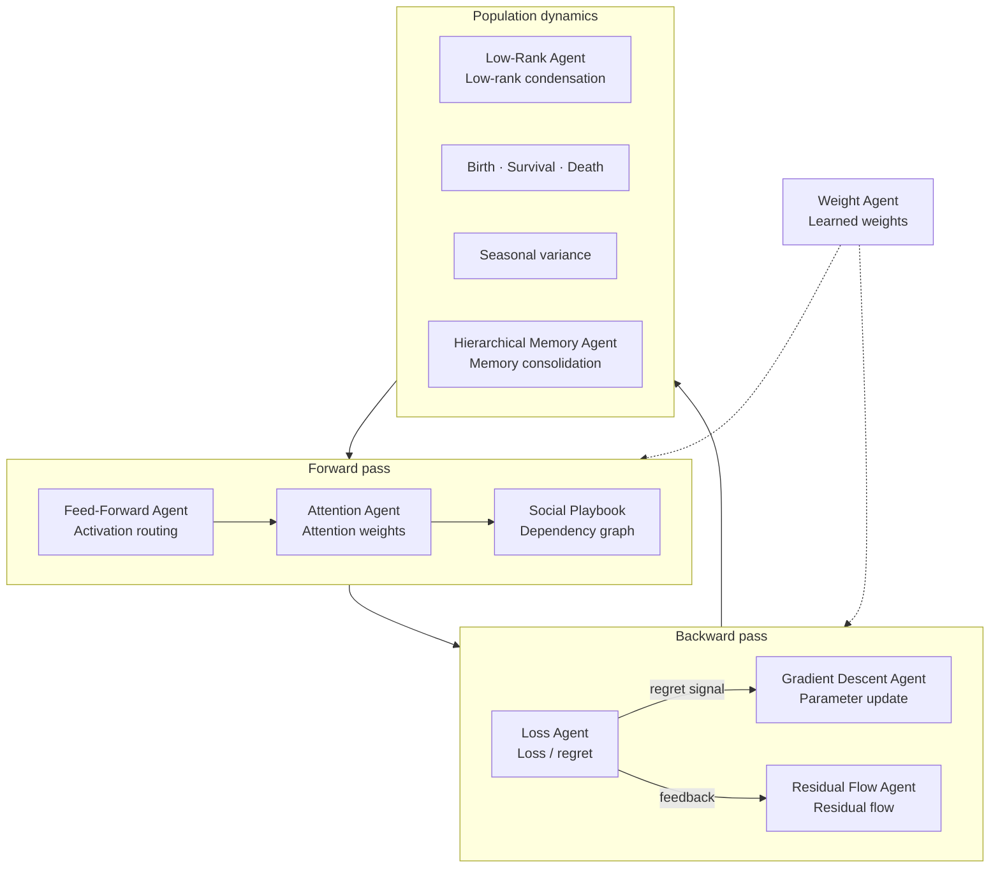
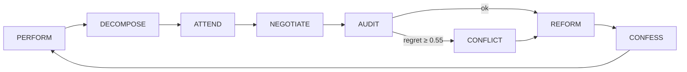

<p align="center">
  
</p>

<h1 align="center">Colony</h1>
<p align="center"><strong>Agent society on a Conway grid</strong></p>
<p align="center">
  A transformer architecture reinterpreted as living social physics —<br/>
  gamified into conscious agents on a Conway ant-farm colony, orchestrated by LangGraph, powered by Qwen Cloud.
</p>

<p align="center">
  
  
  
  
</p>

---

## What is this?

**Colony** is an exploration in qualitative social physics: dozens (or hundreds) of specialist agents inhabit a shared grid, negotiate tasks, resolve conflicts, and iteratively build a collaborative workspace — while you watch them move across a **Conway's Game of Life** substrate in an isometric ant-colony view.

The society is not a chatroom. It is a **closed learning loop** where agents perform work, form dependencies, audit collective regret, reform when misaligned, and write learnings back into the weight graph. Each tick is a forward/backward pass of the transformer role model, made visible on the grid.

| Mode | What happens |
|------|----------------|
| **Run Society** | Full multi-agent LangGraph loop with negotiation, conflict resolution, and live SSE |
| **Run Baseline** | Single-agent control run for apples-to-apples efficiency comparison |
| **Colony Dashboard** | Minimap, sector stats, agent registry, and movement log |

### Successor to [open-deepthink](https://github.com/iblameandrew/open-deepthink)

Colony continues the qualitative-neural-network line from [open-deepthink](https://github.com/iblameandrew/open-deepthink), which mapped agents onto a **layered feed-forward MLP**: parallel layer execution, Mirror Descent on personas, and epoch reframing — without an attention mechanism.

Colony upgrades that design to a **full transformer block**. The society loop implements attention-weighted dependency matching, feed-forward activation routing, residual backward flow, loss/regret, and gradient-style parameter updates — each as a named agent with a social role on the shared grid.

| | open-deepthink | Colony |
|---|----------------|--------|
| **Core analogue** | Stacked MLP layers | Transformer block |
| **Relational scoring** | Layer-to-layer context | **Attention Agent** (pairwise weights) |
| **Forward pass** | Layered parallel forward | Feed-Forward + Input Projection + Multi-Head agents |
| **Backward pass** | Mirror Descent on prompts | Loss + Residual Flow + Gradient Descent agents |
| **Persistent state** | Evolved personas / topology archive | Weight Agent + Social Playbook dependency graph |
| **View** | QNN topology UI | Conway grid + isometric colony |

---

## The Conceptual Transformer

### Transformer as agent society

Colony maps each transformer primitive to a named agent with a fixed **social role** in the simulation. Forward pass agents route work and score dependencies; backward pass agents compute loss, apply updates, and write residuals back into the weight graph. The grid view makes matrix operations legible as agent movement and negotiation.

### Neural component → agent mapping

| Neural / Transformer Component | Agent Role | Social role | Function |
|-------------------------------|------------|-------------|----------|
| Cost function / loss | **Loss Agent** | Auditor | Computes collective regret (loss) against the target state and broadcasts the signal. |
| Backward connections / residual flow | **Residual Flow Agent** | Historian | Propagates feedback along dependency edges (residual / backward flow). |
| Gradient descent / parameter update | **Gradient Descent Agent** | Reformer | Applies parameter updates when alignment drifts (gradient step on roles and traits). |
| Feed-forward activation | **Feed-Forward Agent** | Messenger | Routes activations and task output between agents (feed-forward pass). |
| Learned weights / persistent parameters | **Weight Agent** | Archivist | Stores persistent edge weights and dependency strengths (learned parameters). |
| Core attention mechanism | **Attention Agent** | Matcher | Scores pairwise relevance between agents (attention weights). |
| Attention matrix / dependency graph | **Social Playbook** | Registry | Maintains the live dependency graph: distances, strengths, and rationales. |
| Low-rank condensation / clustering | **Low-Rank Agent** | Governor | Condenses repeated playbook patterns into stable governance rules. |
| Agent creation rule | **Birth mechanism** | Recruiter | Spawns agents when dependency thresholds are met. |
| Persistence rule | **Survival mechanism** | Steward | Keeps agents active while connection strength stays above threshold. |
| Dissolution rule | **Death mechanism** | Recycler | Removes isolated or overloaded agents and returns capacity to the pool. |
| Temporal modulation | **Seasonal variance** | Scheduler | Alternates sharp vs diffuse loss and attention coefficients across ticks. |
| Higher-order memory consolidation | **Hierarchical Memory Agent** | Archivist (long-term) | Summarizes playbook history into hierarchical memory structures. |

### Core agent roles

Each neural operation is an agent with an explicit social function:

- **Loss Agent** — computes and broadcasts regret (loss signal).
- **Residual Flow Agent** — propagates feedback along dependency edges (residual flow).
- **Gradient Descent Agent** — applies parameter updates when alignment drifts (gradient step).
- **Feed-Forward Agent** — routes activations and artifacts between agents (feed-forward pass).
- **Weight Agent** — stores persistent edge weights (learned parameters).
- **Attention Agent** — scores pairwise agent relevance (attention weights).

Together they implement a multi-agent forward/backward loop. **Low-Rank Agent** condenses repeated dependency patterns into governance rules. Birth, survival, and death rules regulate population from connection strength. Seasonal variance toggles how sharply loss and attention are applied each macro-cycle.



> **Operational layer:** The LangGraph loop (PERFORM → DECOMPOSE → ATTEND → …) runs this mapping each tick. The table above is the role model; the [Learning loop](#learning-loop) section below is where it executes.

---

## Colony visualization

The frontend renders a fixed **isometric orthographic** view — like watching an ant farm, not flying a camera.

```
┌─────────────────────────────────────┬──────────────────┐
│  Isometric colony view (ant-farm)   │  Dashboard       │
│  96×96 land patch                   │  · Colony map    │
│  Trees every 8 cells (even grid)    │  · Sector stats  │
│  Conway life = glowing substrate    │  · Agent registry│
│  Agents = instanced voxel cubes     │  · Movement log  │
│  Pan/zoom only (Shift+drag, scroll) │  · Metrics       │
└─────────────────────────────────────┴──────────────────┘
```

| Parameter | Value |
|-----------|-------|
| World grid | 96 × 96 cells |
| Walkable cells | ~9,095 |
| Tree spacing | Every 8 cells (margin 4) |
| Max agents | 512 default swarm (up to 2,048 instanced) |
| Default colony | 48 agents (6 specialists + 42 workers) |

**Controls:** Shift+drag to pan · scroll to zoom · click an agent to inspect dependencies.

---

## Learning loop

Each simulation tick runs the full society graph — the LangGraph loop layered on the transformer role model:

```
PERFORM → DECOMPOSE → ATTEND → NEGOTIATE → AUDIT → CONFLICT? → REFORM → CONFESS
```



| Agent | Transformer analogue | Role |
|-------|---------------------|------|
| **Feed-Forward Agent** | Feed-forward activation | Performs work, proposes artifacts, streams voxel progress |
| **Input Projection Agent** | Task routing / input projection | Breaks the project goal into subtasks, assigns specialists |
| **Attention Agent** | Core attention mechanism | Judges pairwise qualitative dependencies (economic, kinship, prestige…) |
| **Multi-Head Agent** | Multi-head contention resolution | Structured proposal / counter-offer rounds on contested tasks |
| **Loss Agent** | Cost function / loss | Measures collective regret against the *ought* snapshot |
| **Intervention Agent** | High-loss intervention | Voting & compromise when regret spikes or conflict is injected |
| **Gradient Descent Agent** | Gradient descent / update | Adjusts agent adjectives and roles after misalignment |
| **Residual Flow Agent** | Backward / residual flow | Writes learnings to the Weight Agent matrix |
| **Lifecycle** | Birth · survival · death rules | Agents emerge, endure, or dissolve based on dependency strength |
| **Low-Rank Agent** | Low-rank condensation | Condensed governance rules from repeated playbook patterns |
| **Seasons** | Temporal modulation | Sharp vs diffuse judgment across macro/micro cycles |
| **Hierarchical Memory Agent** | Hierarchical memory | Long-horizon synthesis of playbook history |

### Specialist cast

| Specialist | Focus |
|------------|-------|
| Voxel Architect Agent | Conway colony visualization |
| Orchestrator Agent | LangGraph + SSE pipeline |
| Optimizer Agent | Benchmark harness & metrics |
| Integrator Agent | FastAPI + Three.js glue |
| UX Weaver Agent | Dashboard, negotiation panel, controls |
| Critic Evaluator Agent | Society vs baseline comparison |

Workers fill the meadow with foraging, patrol, and relay behaviors — scaling the colony to hundreds of agents.

---

## Track 3 requirements

| Requirement | Implementation |
|-------------|----------------|
| Task decomposition & role assignment | `Input Projection Agent` + `Attention Agent` matching |
| Dialogue & negotiation | `Multi-Head Agent` with live negotiation panel |
| Conflict resolution | `Intervention Agent` on Loss Agent regret ≥ 0.55 |
| Efficiency gain | Dual mode + live metrics dashboard |

---

## Quick start

### Prerequisites

- Python 3.11+
- Node.js 18+
- [DashScope API key](https://dashscope.aliyun.com/) for Qwen Cloud (optional for UI; required for LLM calls)

### 1. Backend

```bash
cd backend
pip install -e .
uvicorn app.main:app --reload --port 8000
```

### 2. Frontend

```bash
cd frontend
npm install
npm run dev
```

### 3. Open the app

**http://localhost:5173**

The Vite dev server proxies `/api` → `http://localhost:8000`.

---

## Demo walkthrough

1. **Settings** → paste your DashScope API key → **Connect**
2. **Controls** → set colony size (default 48) → **Run Society**
3. **Colony** tab → watch minimap, sectors, and agent registry populate
4. **Metrics** tab → compare society vs baseline after both runs
5. **Inject Conflict** → trigger the conflict-resolution demo mid-run
6. **Step** / **Advance Phase** / **Pause** for manual pacing

---

## Qwen Cloud configuration

All agent roles use **Qwen Cloud (DashScope)** exclusively.

```bash
# Environment (optional — can also set via UI)
DASHSCOPE_API_KEY=sk-...
QWEN_API_KEY=sk-...                              # alias
QWEN_MODEL=qwen3.7-max-2026-06-08                # default flagship (pinned)
```

Per-role overrides are available in the **Settings** tab. The dashboard loads the current **Qwen3.x catalogue** from the API (flagship, balanced, fast, vision, coder, and legacy models).

Suggested mapping (June 2026):

| Role | Model |
|------|-------|
| Loss, Attention, Gradient Descent, Multi-Head, Intervention, Baseline Agents | `qwen3.7-max-2026-06-08` |
| Feed-Forward, Input Projection Agents | `qwen3.7-plus-2026-06-08` |
| Residual Flow, Weight Agents | `qwen3.6-plus-2026-04-02` |
| Voxel Architect, Orchestrator, Integrator | `qwen2.5-coder-32b-instruct` |
| Fast / lightweight agents | `qwen3.6-flash-2026-04-02` |
| Vision / UI tasks | `qwen3-vl-plus` or `qwen3-vl-max` |

### API endpoints

| Method | Path | Description |
|--------|------|-------------|
| `GET` | `/api/health` | Service health |
| `GET` | `/api/state` | Full simulation snapshot + colony stats |
| `GET` | `/api/stream` | SSE event stream |
| `POST` | `/api/sim/society` | Start society run `{ max_ticks, speed, agent_count }` |
| `POST` | `/api/sim/baseline` | Start baseline run |
| `POST` | `/api/sim/inject-conflict` | Force conflict resolution |
| `POST` | `/api/sim/step` | Advance one tick |
| `POST` | `/api/sim/pause` | Toggle pause |
| `GET` | `/api/metrics` | Society vs baseline comparison |
| `GET` | `/api/qwen/status` | Provider status & usage |
| `POST` | `/api/qwen/api-key` | Set API key for session |
| `POST` | `/api/qwen/configure` | Per-role model override |

---

## Architecture

```
colony/
├── backend/
│   └── app/
│       ├── agents/          # Attention, Auditor, Negotiator, …
│       ├── graph/           # LangGraph simulation graph
│       ├── grid.py          # 96×96 allocation, sectors, walkability
│       ├── llm/             # QwenLLMFactory (DashScope)
│       ├── lifecycle/       # Birth/death on dependency graph
│       ├── simulation/      # Async runner + SSE queue
│       └── api/routes.py    # FastAPI endpoints
├── frontend/
│   └── src/
│       ├── scene/colony-scene.ts  # Isometric Conway colony (Three.js)
│       ├── ui/Dashboard.ts      # Tabbed dashboard + colony panel
│       └── sse/client.ts        # Live event stream
└── docs/
    └── colony-banner.jpg             # Retro voxel banner (Grok Imagine)
```

**Backend:** FastAPI · LangGraph · LangChain · Pydantic · SSE-Starlette · scikit-learn (Attention embeddings)

**Frontend:** TypeScript · Vite · Three.js (instanced meshes, orthographic isometric camera)

---

## Society vs baseline metrics

After running both modes, the dashboard compares:

- **Quality score** (1 − Auditor regret)
- **Iterations** to completion
- **Conflicts detected / resolved**
- **Negotiation rounds**
- **Transparency events** (SSE + playbook entries)
- **Token usage** (Qwen Cloud)
- **Colony progress** (%)

The society is designed to win on **quality and transparency** while the baseline wins on raw iteration count — making the tradeoff visible and measurable.

---

## Development

```bash
# Frontend production build
cd frontend && npm run build

# Backend health check
curl http://localhost:8000/api/health
```

Grid constants live in `backend/app/grid.py` and mirror `frontend/src/scene/colony-scene.ts` (`WORLD_SIZE=96`, `TREE_SPACING=8`).

---

## License

MIT — built for the Agent Society Design hackathon track.

<p align="center"><sub>Transformer primitives as social roles. Watch the colony compute.</sub></p>